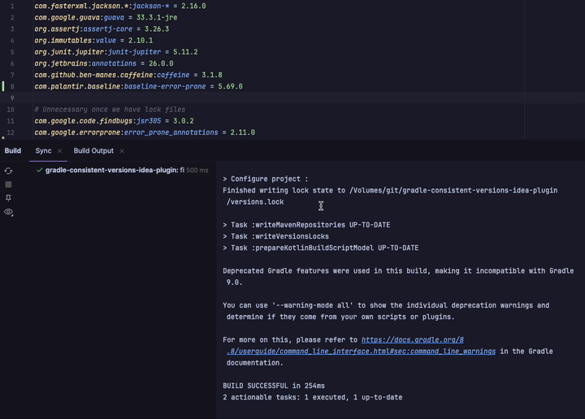
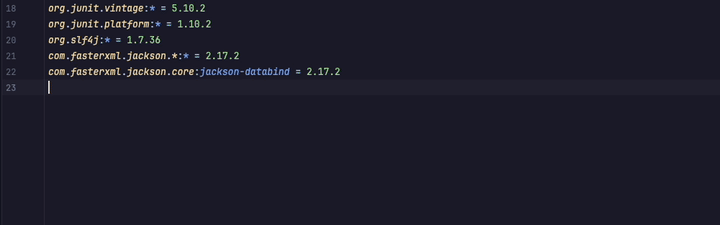
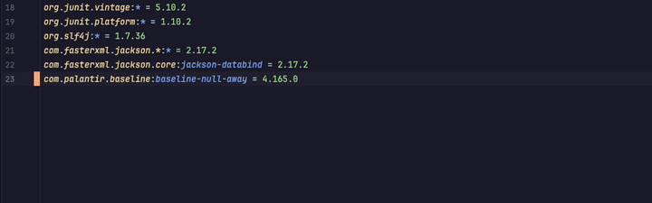
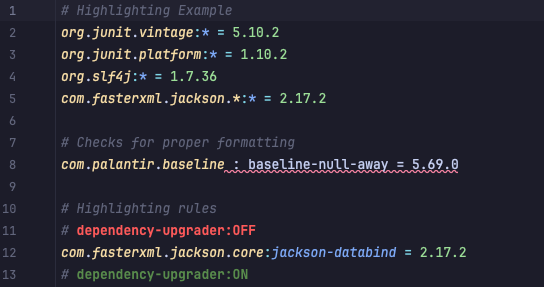
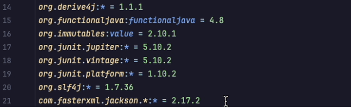

<p align="right">
<a href="https://autorelease.general.dmz.palantir.tech/palantir/gradle-consistent-versions-idea-plugin"></a>
</p>

# Gradle Consistent Versions Idea Plugin

An intellij plugin for use with [gradle consistent versions](https://github.com/palantir/gradle-consistent-versions)

## Features:
### Automatic gradle refresh when changes are detected in `versions.props`
No more worrying about running `writeVersionsLock` simply save your `versions.props` file and the plugin will automatically trigger write locks and refresh the project.



### Auto-complete for packages and versions in `versions.props`
Simply have version `2.26.0` or higher of the `gradle-consistent-versions` plugin applied, and you will get auto complete suggestions directly in `versions.props`.



Skip the guessing game get the latest version by typing `latest`.



Superfast auto-complete directly from your gradle cache allows for full package auto complete.


### Project Level Disable
Either disable via the settings page or add the following to a projects `.idea/gcv-plugin-settings.xml`
```xml
<?xml version="1.0" encoding="UTF-8"?>
<project version="4">
  <component name="ProjectSettings">
    <option name="enabled" value="false" />
  </component>
</project>
```


### Syntax highlighting
`versions.props` files have syntax highlighting and proper parsing to ensure they are correctly formatted. With highlighting rules to clearly mark `dependency-upgrader` controls.



### Commenter support
Create comments automatically using the intellij shortcut


